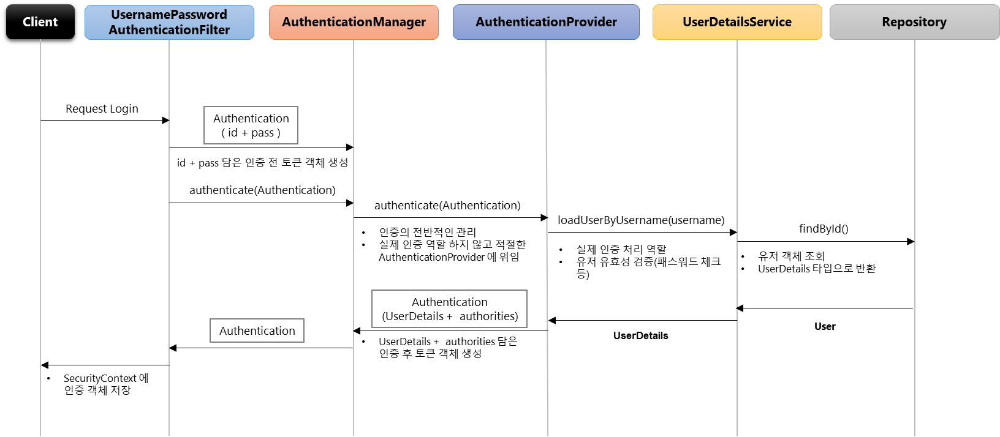
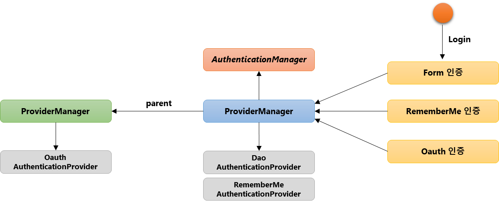
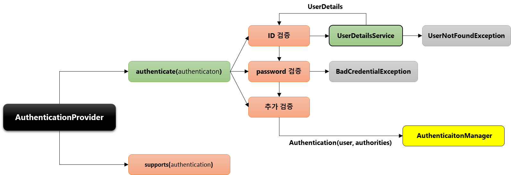
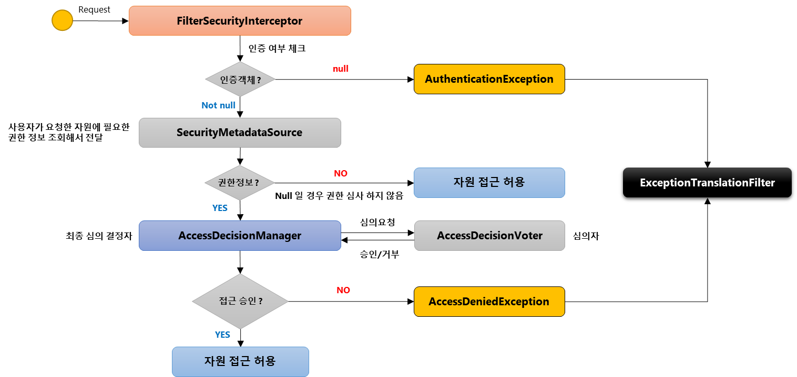
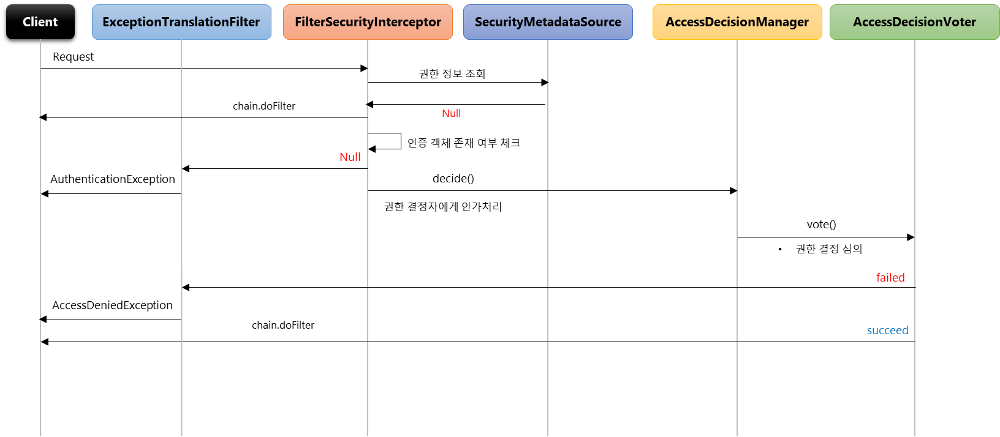
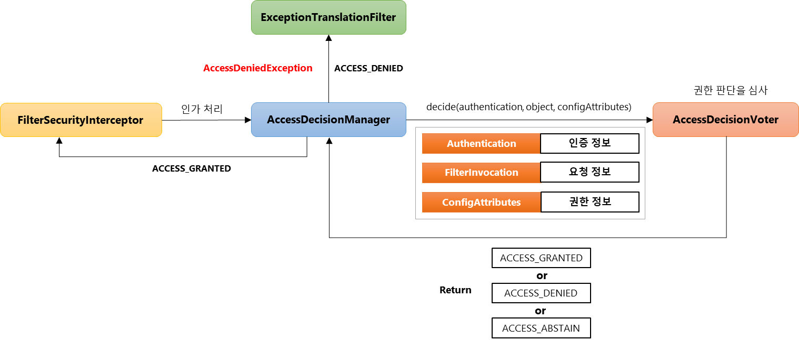
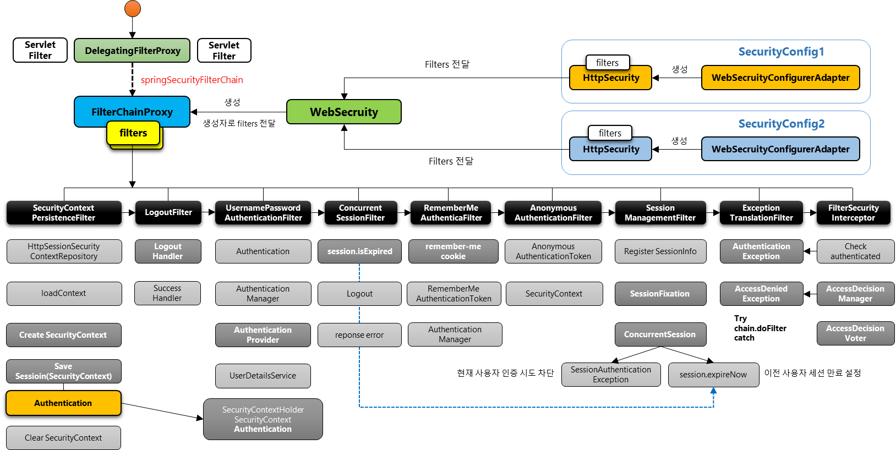

# 스프링 시큐리티 기본 API 공부

### 스프링 시큐리티 의존성 추가시 일어나는 일들

* 서버 기동시 스프링 시큐리티의 초기화 작업 및 보안 설정.
* 별도의 설정이나 구현을 하지 않아도  
  기본적인 웹 보안 기능이 현재 시스템에 연동되어 작동함
    1. 모든 요청은 인증이 되어야 자원에 접근이 가능
    2. 인증 방식은 폼 로그인 방식과 httpBasic 로그인 방식을 제공
    3. 기본 로그인 페이지 제공
    4. 기본 계정 한 개 제공

    * username : user
    * password : 무작위 문자열
    ```
    2021-04-11 17:06:47.362  INFO 5156 --- [  restartedMain] .s.s.UserDetailsServiceAutoConfiguration :
    Using generated security password: c562795a-04ac-4300-a234-e3327a7b2dd2
    ```

```java
//자동 웹 보안 설정 클래스
@Configuration(proxyBeanMethods = false)
@ConditionalOnClass(DefaultAuthenticationEventPublisher.class)
@EnableConfigurationProperties(SecurityProperties.class)
@Import({SpringBootWebSecurityConfiguration.class, WebSecurityEnablerConfiguration.class,
	SecurityDataConfiguration.class})
public class SecurityAutoConfiguration {

	@Bean
	@ConditionalOnMissingBean(AuthenticationEventPublisher.class)
	public DefaultAuthenticationEventPublisher authenticationEventPublisher(
		ApplicationEventPublisher publisher) {
		return new DefaultAuthenticationEventPublisher(publisher);
	}

}
```

일반적으로 부트에서 시큐리티를 사용시에는 해당 자동 설정 클래스를 제외처리 하지 않고 개발자가 설정한 옵션이 먼저 적용되도록 설정함

그 이유로는 자동 설정 기능을 제외시에 따로 설정 및 선언해야 할게 너무 많음.

기본 설정만으로도 훌륭한 보안 체계를 가짐.

그럼에도 불구하고 따로 설정을 기술하는 이유는  
해당 어플리케이션에 맞게 커스터마이징과 미흡한 부분(DB 연동, 계층형 권한 등등)으로 인해서.


---

#### 사용자 정의 보안 기능

SecurityConfig (상속)-> __WebSecurityConfigurerAdapter__ -> __HttpSecurity__ (인증 API, 인가 API)

기본 __HttpSecurity__

```java
protected void configure(HttpSecurity http)throws Exception {
	this.logger.debug("Using default configure(HttpSecurity). "
	+"If subclassed this will potentially override subclass configure(HttpSecurity).");
	http.authorizeRequests((requests)->requests.anyRequest().authenticated());
	http.formLogin();
	http.httpBasic();
}
```

---

#### 폼 로그인 관련 설정

`http.formLogin()`

```java
protected void configure(HttpSecurity http)throws Exception {
	http
        .formLogin()                            // 폼 로그인 사용 설정
	    .loginPage("/login.html")               // 사용자 정의 로그인 페이지
	    .defaultSuccessUrl("/home")             // 로그인 성공 후 이동 페이지
        .failureUrl("/login.html?error=true")   // 로그인 실패 후 이동 페이지
        .usernameParameter("username")          // 아이디 파라미터명 설정
        .passwordParameter("password")          // 패스워드 파라미터명 설정
        .loginProcessingUrl("/login")           // 로그인 폼 ActionUrl
        .successHandler(LoginSuccessHandler())  // 로그인 성공 후 핸들러
        .failureHandler(loginFailureHandler())  // 로그인 실패 후 핸들러
}
```
---
#### 인증과 권한

* Authentication 인증  
  애플리케이션에서 인증 절차를 통해 권한을 확인하는 과정
* Authorization 권한  
  요청에 대한 권한을 가지고 있는가 확인 하는 과정.
  
##### Authentication

* `principal` - 서비스에 접근하는 유저 정보 객체
* `Authentication` - Spring Security 에서 한 유저의 인증 정보를 가지고 있는 객체로  
  사용자가 인증 과정을 성공적으로 마칠 시.  
  Spring Security는 사용자의 정보 및 인증 성공 여부를 가지고  
  `Authentication` 객체를 생성 후 보관한다.
* `SecurityContextHolder` - `Authentication` 객체를 보관하는 곳.  
  어플리케이션 어디서는 접근 가능.
* `UserDetails` - 일반 서비스의 사용자 객체를  
  Spring Security에서 사용하는 사용자 객체와 연결 및 변환 해주는 어댑터 역활.
* `UserDetailsService` - Spring Security에서 로그인시에 전달된 정보를 기반으로  
  DB에서 유저를 가져오는 서비스를 하는 인터페이스.
* `GrantedAuthority` - 사용자에게 주어진 어플리케이션 사용 권한 객체.
* `PasswordEncoder` - DB에 사용자의 정보 저장시 비밀번호를 암호화  
  인증시 입력된 비밀번호와 저장된 비밀번호 비교하는 객체.
  
---

#### 로그아웃 

`LogoutFilter` 를 통해 처리됨.

`Authentication` 인증 객체를 가져와서 `SecurityContextLogoutHandler` 를 통해 처리.

`SecurityContextLogoutHandler`는 주로
1. 세션 무효화
2. 쿠키 삭제
3. `SecurityContextHolder.clearContext()` 호출  
   인증 관련 저장 객체에서 인증 객체 비워줌.
   
처리 완료후 `SimpleUrlLogoutSuccessHandler`를 통해 리다이렉트 처리.

```java
protected void configure(HttpSecurity http) throws Exception {
	http.logout()                                       // 로그아웃 처리
        .logoutUrl("/logout")                           // 로그아웃 처리 URL
        .logoutSuccessUrl("/login")                     // 로그아웃 성공 후 이동페이지
        .deleteCookies("JSESSIONID","remember-me")      // 로그아웃 후 쿠키 삭제
        .addLogoutHandler(logoutHandler())              // 로그아웃 핸들러
        .logoutSuccessHandler(logoutSuccessHandler())   // 로그아웃 성공 후 핸들러
}
```

---

#### Remember Me 인증

세션 만료되고 웹 브라우저 종료 후에도 사용자를 기억하는 기능
 
처리 절차  
1. `Remember-Me` 쿠키 생성
2. Http 요청을 통한 토큰 기반 인증 및 유효성 검사
3. 검증 완료 시 사용자 로그인.

라이프 사이클
* 인증 성공  
   `Remember-Me` 쿠키 설정
* 인증 실패  
  쿠키 존재시 쿠키 무표화
* 로그아웃
  쿠키 존재시 쿠키 무효화
  
```java
protected void configure(HttpSecurity http) throws Exception {
	http.rememberMe()
            .rememberMeParameter("remember")        // 기본 파라미터 명은 remember-me
            .tokenValiditySeconds(3600)             // 기본값은 14일
            .alwaysRemember(true)                   // 리멤버 미 기능을 활성화하지 않아도 항상 실행
            .userDetailsService(userDetailsService)
}
```

##### RememberMeAuthenticationFilter

Request   
-> RememberMeAuthenticationFilter   
-> RememberMeServices  
-> Token Cookie 추출  
-> Token 유무 확인 -> 없을시 다음 필터로   
-> Decode Token -> 토큰 불일치시 Exception 발생  
-> Token 일치 확인 -> 불일치시 Exception 발생   
-> User 계정 확인 -> 없을시 Exception 발생   
-> 새로운 Authentication 생성 (RememberMeAuthenticationToken)   
-> AuthenticationManager

필터의 처리 조건
1. `Authentication` 인증 객체가 `null`일 경우.  
   `SecurityContext` 인증 객체가 `null` 인 경우  
   -> 세션 만료 혹은 브라우저 종료되어 세션 종료시.
2. `Remember-Me` 토큰이 발급되어 쿠키를 가져오는 경우.

`RememberMeServices`
* `TokenBasedRememberMeServices`  
  메모리에서 토큰 저장하여 비교 및 인증 처리
* `PersistentTokenBasedRememberMeServices`  
  DB에 토큰 저장하여 비교 및 인증 처리
  
---
#### 익명사용자

`AnonymousAuthenticationFilter` 를 통해 익명 사용자 처리  
(별도의 익명사용자 Authentication 객체 사용)

* 익명사용자와 인증 사용자를 구분해서 처리하기 위해 사용
* 인증 여부 구현시 `isAnonymous()` 와 `isAuthenticated()`로 구분하여 사용
* 인증 객체를 세션에 저장하지 않음.

---
#### 세션 관련

__동시 세션 제어__  
동일한 계정에 대한 제어  
최대 세션 허용 개수 초과  
1. 이전 사용자 세션 만료
2. 현재 사용자 인증 실패

```java
protected void configure(HttpSecurity http) throws Exception {
	http.sessionManagement()
        .maximumSessions(1)                 // 세션 최대 허용 가능 수, -1 : 무제한
        .maxSessionsPreventsLogin(true)     // 동시 로그인 차단, false : 기존 세션 만료(기본값)
        .invalidSessionUrl("/invalid")      // 세션 유효하지 않을 시 이동 페이지
        .expiredUrl("/expired")             // 세션 만료후 이동 페이지
}
```

__세션 고정 보호__
인증 성공시 새로운 세션 생성하여 고정 세션 공격 방지.

```java
protected void configure(HttpSecurity http) throws Exception {
	http.sessionManagement()
        .sessionFixation().changeSessionId() //기본값
                                             // none, migrateSession, newSession
}
```

__세션 정책__

세션 관리 정책
```java
protected void configure(HttpSecurity http) throws Exception {
	http.sessionManagement()
        .sessionCreationPolicy(SessionCreationPolicy.If_Required)
        // Always - 시큐리티가 항상 세션 생성
        // If_Required - 시큐리티가 필요 시 생성 (기본 값)
        // Never - 시큐리티가 생성하지 않지만 존재시 사용
        // Stateless - 시큐리가 생성하지 않고 사용하지도 않음
}
```
##### 세션 제어 필터

__SessionManagementFilter__

__ConcurrentSessionFilter__

동시 세션 제어  
* 매 요청 마다 현재 사용자의 세션 만료 여부 체크
* 세션이 만료되었을 경우 즉시 만료 처리

* `session.isExpired() == true`
  * 로그아웃 처리
  * 즉시 오류 페이지 응답  
    > This session has been expired
---
#### 권한 설정과 표현식

* 선언적 방식
  * URL
    * `http.antMatcher("/users/**").hasRole("USER")`
  * Method
    * ```java
      @PreAuthorize("hasRole('USER')")
      public void user() { System.out.println("user");}
      ``` 
* 동적 방식
  * URL
  * Method

##### 권한 설정

__URL__ 방식
```java
//설정시 구체적인 경로가 먼저오고 그것 보다 큰 범위의 경로가 뒤에 오도록 설정해야 함.
protected void configure(HttpSecurity http) throws Exception {
    http
        .antMatcher("/shop/**")
        .authorizeRequests()
            .antMatchers("/shop/login", "/shop/users/**").permitAll()
            .antMatchers("/shop/mypage").hasRole("USER")
            .antMatchers("/shop/admin/pay").access("hasRole('ADMIN')")
            .antMatchers("/shop/admin/**").access("hasRole('ADMIN') or hasRole('SYS')")
            .anyRequest().authenticated();
}
```

__Method__ 방식

`authenticated()` - 인증된 사용자의 접근을 허용  
`fullyAuthenticated()` - 인증된 사용자의 접근을 허용, rememberMe 인증 제외  
`permitAll()` - 무조건 접근을 허용  
`denyAll()` - 무조건 접근을 허용하지 않음  
`anonymous()` - 익명사용자의 접근을 허용  
`rememberMe()` - 기억하기를 통해 인증된 사용자의 접근을 허용  
`access(String)` - 주어진 SpEL 표현식의 평가 결과가 true이면 접근을 허용  
`hasRole(String)` - 사용자가 주어진 역활이 있다면 접근을 허용  
`hasAuthority(String)` - 사용자가 주어진 권한이 있다면  
`hasAnyRole(String...)` - 사용자가 주어진 권한이 있다면 접근을 허용  
`hasAnyAUthority(String...)` - 사용자가 주어진 권한 중 어떤 것이라도 있다면 접근을 허용  
`hasIpAddress(String)` - 주어진 IP로부터 요청이 왔다면 접근을 허용  

---
#### 예외 처리 및 요청 캐시 필터 - `ExceptionTranslationFilter`

`FilterSecurityIntercepter` 맨 마지막에 위치한 인터셉터로 인증 및 인가 예외 발생

__AuthenticationException__  
* 인증 예외 처리
  1. `AuthenticationEntryPoint` 호출
      * 로그인 페이지 이동, 401 오류 코드 전달 등
  2. 인증 예외가 발생하기 전의 요청 정보를 저장
      * `RequestCache` - 사용자의 이전 요청 정보를 세션에 저장하고 이를 꺼내오는 캐시.
        * `SavedRequest` - 사용자가 요청했던 request 파라미터 값들,   
                          그 당시의 헤더값들 등이 저장

__AccessDeniedException__
  * 인가 예외 처리
    * `AccessDeniedHandler` 에서 예외 처리하도록 제공
  
```java
protected void configure(HttpSecurity http) throws Exception {
    http.exceptionHandling()
        .authenticationEntryPoint(authenticationEntryPoint()) // 인증 실패시 처리
        .accessDeniedHandler(accessDeniedHandler())           // 인가 실패시 처리
}
```
----
#### CSRF, CsrfFilter

사용자간 요청 위조 방지.

모든 요청에 대해 랜덤하게 생성된 토큰을 HTTP 파라미터로 요구
요청 시 전달되는 토큰 값과 서버에 저장된 실제 값ㅇ과 비교한 후 만약 일치하지 않으면 요청은 실패한다.

* Client
    * `<input type="hidden" name="${_csrf.parameterName}" value="${_csrf.token}" />`
    * HTTP 메소드 - PATCH, POST, PUT, DELETE
* Spring Security
    * `http.csrf()` - 기본 활성화
    * `http.csrf().disabled()` - 비활성화
    
---
# 시큐리티 아키텍쳐

### 위임 필터 및 필터 빈 초기화 - DelegatingProxyChain, FilterChainProxy

#### DelegatingProxyChain

시큐리티에서 `DelegatingFilterProxy`를 구현하여 스프링 빈에게 요청 위임

1. 서블릿 필터는 스프링에서 정의된 빈을 주입해서 사용할 수 없음
2. 특정한 이름을 가진 스프링 빈을 찾아 그 빈에게 요청을 위임
    * `SpringSecurityFilterChain` 이름으로 생성된 빈을   
      `ApplicationContext`에서 찾아 요청을 위임
    * __실제 보안처리를 하지 않음.__


#### FilterChainProxy


1. `springSecurityFilterChain` 의 이름으로 생성되는 필터 빈
2. `DelegatingFilterProxy` 으로 부터 요청을 위임 받고 실제 보안 처리
3. 스프링 시큐리티 초기화 시 생성되는 필터들을 관리하고 제어
    * 스프링 시큐리티가 기본적으로 생성하는 필터
    * 설정 클래스에서 API 추가시 생성되는 필터
4. 사용자의 요청을 필터 순서대로 호출하여 전달
5. 사용자 정의 필터를 생성해서 기존의 필터 전, 후로 추가 가능
    * 필터의 순서를 잘 정의해야함.
6. 마지막 필터까지 인증 및 인가 예외가 발생하지 않으면 보안 통과
---

### 필터 초기화와 다중 보안 설정

* 설정클래스 별로 보안 기능이 각각 작동
* 설정클래스 별로 `RequestMatcher` 설정
    * `http.antMatcher("/admin/**")`
* 설정클래스 별로 필터가 생성
* `FilterChainProxy` 가 각 필터들을 가지고 있음
* 요청에 따라 `RequestMatcher` 와 매칭되는 필터가 작동하도록 함

```java
@Configuration
@Order(0)
public class SecurityConfig extends WebSecurityConfigurerAdapter {
	protected void configure(HttpSecurity http) throws Exception {
		http
            .antMatcher("/admin/**")
            .authorizeRequests()
            .anyRequest().authenticated()
            .and()
            .httpBasic();
    }
}
```

```java
@Configuration
@Order(1)
public class SecurityConfig extends WebSecurityConfigurerAdapter {
	protected void configure(HttpSecurity http) throws Exception {
		http            
            .authorizeRequests()
            .anyRequest().permitAll()
            .and()
            .formLogin();
    }
}
```
---
### Authentication

인증, 인증 주체

__당신이 누구인지 증명하는 것__

* 사용자의 인증 정보를 저장하는 토큰 개념
* 인증 시 `id` 와 `password` 를 담고 인증 검증을 위해 전달되어 사용된다
* 인증 후 최종 인증 결과 (`user` 객체, 권한 정보) 를 담고 `SecurityContext` 에 저장되어 전역적으로 참조가 가능하다
    * `Authentication authentication = SecurityContextHolder.getContext().getAuthentication()`
    1. `principal` : 사용자 아이디 혹은 User 객체를 저장
    2. `credentials` : 사용자 비밀번호
    3. `authorities` : 인증된 사용자의 권한 목록
    4. `details` : 인증 부가 정보
    5. `Authenticated` : 인증 여부
    
---
### SecurityContextHolder, SecurityContext

`SecurityContext`
* `Authentication` 객체가 저장되는 보관소로 필요시 언제든지 `Authentication` 객체를 꺼내어 쓸 수 있도록 제공되는 클래스
* `ThreadLocal` 에 저장되어 아무 곳에서나 참조가 가능하도록 설계함
* 인증이 완료되면 `HttpSession` 에 저장되어 어플리케이션 전반에 걸쳐 전역적인 참조가 가능하다

`SecurityContextHolder`
* `SecurityContext` 객체 저장방식
    * `MODE_THREADLOCAL` - 쓰레드당 `SecurityContext` 객체를 할당, __기본값__
    * `MODE_INHERITABLETHREADLOCAL` - 메인 스레드와 자식 스레드에 관하여 동일한 `SecurityContext` 를 유지
    * `MODE_GLOBAL` - 응용 프로그램에서 단 하나의 `SecurityContext`를 저장한다
* `SecurityContextHolder.clearContext()` - `SecurityContext` 기존 정보 초기화  

* `Authentication authentication = SecurityContextHolder.getContext().getAuthentication()`

---
### SecurityContextPersistenceFilter

`SecurityContext` 객체의 생성, 저장, 조회

* 익명사용자
    * 새로운 `SecurityContext` 객체를 생성하여 `SecurityContextHolder`에 저장
    * `AnonymousAuthenticationFilter` 에서 `AnonymousAuthenticationToken` 객체를 `SecurityContext` 에 저장
* 인증시
    * 새로운 `SecurityContext` 객체를 생성하여 `SecurityContextHolder` 에 저장
    * `UsernamePassowrdAUthenticationFilter` 에서 인증 성공 후 `SecurityContext`에 `UsernamePasswordAuthentication` 객체를 `SecurityContext`에 저장
    * 인증이 최종 완료되면 `Session`에 `SecurityContext`를 저장
* 인증후
    * `Session`에서 `SecurityContext` 꺼내어 `SecurityContextHolder`에서 저장
    * `SecurityContext` 안에 `Authentication` 객체가 존재하면 계속 인증을 유지한다.
* 최종 응답시 공통
    * `SecurityContextHolder.clearContext()`
    
---
### Authentication Flow



---
### AuthenticationManager



* `AuthenticationProvider` 목록 중에서 인증 처리 요건에 맞는 `AuthenticationProvider`를 찾아 인증처리를 위임한다
* 부모 `ProviderManager`를 설정하여 `AuthenticationProvider`를 계속 탐색 할 수 있다

---
### AuthenticationProvider



---
### Authorization

__당신에게 무엇이 허가 되었는지 증명하는 것__

시큐리티가 지원하는 권한 계층
* 웹 계층
    * URL 요청에 따른 메뉴 혹은 화면 단위의 레벨 보안
* 서비스 계층
    * 화면 단위가 아닌 메소드 같은 기능 단위의 레벨 보안
* 도메인 계층 (Access Control List, 접근 제어 목록)
    * 객체 단위의 레벨 보안

### FilterSecurityInterceptor

* 마지막에 위치한 필터로써 인증된 사용자에 대해 특정 요청의 승인/거부 여부를 최종적으로 결정
* 인증 객체 없이 보호 자원에 접근을 시도할 경우 `AuthenticationException`을 발생
* 인증 후 자원에 접근 가능한 권한이 존재하지 않을 경우 `AccessDeninedException`을 발생
* 권한 제어 방식 중 HTTP 자원의 보안을 처리하는 필터
* 권한 처리를 `AccessDecisionManager`에게 맡김




___

### AccessDecisionManager

* 인증 정보, 요청 정보, 권한 정보를 이용해서 사용자의 자원 접근을 허용할 것인지 거부할 것인지를 최종 결정하는 주체
* 여러 개의 `Voter`들을 가질 수 있으며 `Voter`들로부터 접근허용, 거부, 보류에 해당하는 각각의 값을 리턴받고 판단 및 결정
* 최종 접근 거부 시 예외 발생

* __접근 결정의 세가지 유형__
    * `AffirmativeBased`
        * 여러개의 `Voter` 클래스 중 하나라도 접근 허가로 결론을 내면 접근 허가로 판단한다
    * `ConsensusBased`
        * 다수표(승인 및 거부) 에 의해 최종 결정을 판단한다
        * 동수일 경우 기본은 접근 허가이나 `allowIfEqualGrantedDeninedDecisions`을 `false`로 설정할 경우 접근 거부로 결정
    * `UnanimousBased`
        * 모든 보터가 만장일치로 접근을 승인해야 하면, 그렇지 않을 경우 접근 거부
    
---
### AccessDecisionVoter

* 판단을 심사하는 것

* `Voter`가 권한 부여 과정에서 판단하는 자료
    * `Authentication` - 인증정보 (`user`)
    * `FilterInvocation` - 요청 정보 (`antMatcher("/user")`)
    * `ConfigAttributes` - 권한 정보 (`hasRole("USER")`)
    
* 결정 방식
    * `ACCESS_GRANTED` - 접근 허용 (1)
    * `ACCESS_DENINED` - 접근 거부 (0)
    * `ACCESS_ABSTAIN` - 접근 보류 (-1)
        * `Voter`가 해당 타입의 요청에 대해 결정을 내릴 수 없는 경우
    


---
#### 전체 아키텍쳐

